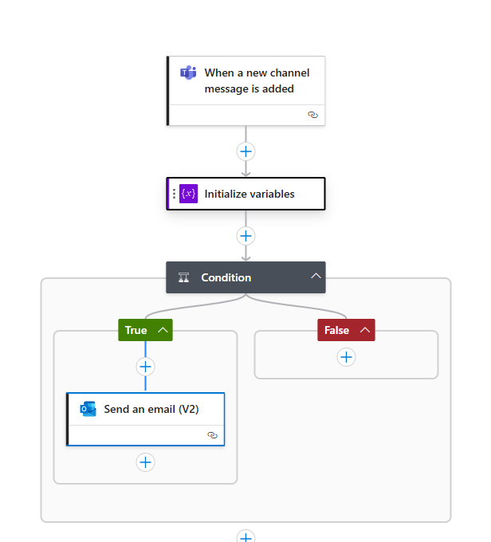

# CST 8917 Lab 3

## image of the workflow

## description of the workflow

### code of the workflow

{
    "definition": {
        "$schema": "https://schema.management.azure.com/providers/Microsoft.Logic/schemas/2016-06-01/workflowdefinition.json#",
        "contentVersion": "1.0.0.0",
        "triggers": {
            "When_a_new_channel_message_is_added": {
                "type": "ApiConnection",
                "inputs": {
                    "host": {
                        "connection": {
                            "name": "@parameters('$connections')['teams']['connectionId']"
                        }
                    },
                    "method": "get",
                    "path": "/trigger/beta/teams/@{encodeURIComponent('863425d7-9091-4e56-8c22-4bb68f895a2e')}/channels/@{encodeURIComponent('19:NMAq7UESJTiCD0bmJ20fNtPpJCnGBTKQAv0iU9Z826w1@thread.tacv2')}/messages",
                    "queries": {
                        "$top": 50
                    }
                },
                "recurrence": {
                    "interval": 1,
                    "frequency": "Minute"
                },
                "splitOn": "@triggerBody()"
            }
        },
        "actions": {
            "Initialize_variables": {
                "type": "InitializeVariable",
                "inputs": {
                    "variables": [
                        {
                            "name": "message",
                            "type": "string",
                            "value": "@{triggerBody()?['body']?['content']}"
                        }
                    ]
                },
                "runAfter": {}
            },
            "Condition": {
                "type": "If",
                "expression": {
                    "or": [
                        {
                            "contains": [
                                "@variables('message')",
                                "hate"
                            ]
                        },
                        {
                            "contains": [
                                "@variables('message')",
                                "hated"
                            ]
                        },
                        {
                            "contains": [
                                "@variables('message')",
                                "suck"
                            ]
                        }
                    ]
                },
                "actions": {
                    "Send_an_email_(V2)": {
                        "type": "ApiConnection",
                        "inputs": {
                            "host": {
                                "connection": {
                                    "name": "@parameters('$connections')['outlook']['connectionId']"
                                }
                            },
                            "method": "post",
                            "body": {
                                "To": "balc0022@algonquinlive.com",
                                "Subject": "someone has inaproprate behavor in the team chat",
                                "Body": "
someone has inaproprate behavor in the team chat and say \"@{variables('message')}\"
",
                                "Importance": "Normal"
                            },
                            "path": "/v2/Mail"
                        }
                    }
                },
                "else": {
                    "actions": {}
                },
                "runAfter": {
                    "Initialize_variables": [
                        "Succeeded"
                    ]
                }
            }
        },
        "outputs": {},
        "parameters": {
            "$connections": {
                "type": "Object",
                "defaultValue": {}
            }
        }
    },
    "parameters": {
        "$connections": {
            "type": "Object",
            "value": {
                "teams": {
                    "id": "/subscriptions/3b36c431-a92e-4ac8-927b-17a0f4b30054/providers/Microsoft.Web/locations/eastus/managedApis/teams",
                    "connectionId": "/subscriptions/3b36c431-a92e-4ac8-927b-17a0f4b30054/resourceGroups/cst8919-lab3/providers/Microsoft.Web/connections/teams-1",
                    "connectionName": "teams-1"
                },
                "outlook": {
                    "id": "/subscriptions/3b36c431-a92e-4ac8-927b-17a0f4b30054/providers/Microsoft.Web/locations/eastus/managedApis/outlook",
                    "connectionId": "/subscriptions/3b36c431-a92e-4ac8-927b-17a0f4b30054/resourceGroups/cst8919-lab3/providers/Microsoft.Web/connections/outlook-2",
                    "connectionName": "outlook-2"
                }
            }
        }
    }
}

### Description

#### Trigger: "When a new channel message is added"

This trigger is connected to the team’s application. It connects to a specific channel in a specific group and detect if there is a new message added to the channel. 

#### Action: "Initialize variables"

After the teams’ trigger, the Initialize variables action is run that it will take the new created message and store it in the variable called "message"

#### Condition

After the Initialize variables, action is run, there will be a condition. In the condition it will tell if there are bad words made in the "message" variable. It has an OR statement that if "fu**", "sh**" or "bit**" is contain in the message, it will lead to the True branch. If not, then it will go the False branch.

#### Email notifications

It if goes to the True branch, then it will run the Email action that will send an email to the admin to tell there are bad word in the team channel. It will contain the subject of what the email is about and the body explaining that there are inappropriate behavior in the chat and the message variable.

## how to do testing

For testing I put an email notification action after each trigger/action to see if the results of the triggers/actions are working or passing the correct values. I also use this strategy to see if the condition is working correctly. Also, I use an inactive channel that not many people use to test my workflow by adding messages with and without inappropriate behavior to test if the workflow works. 

## Challenges

The challenges I face in this Lab is that I need to find a way to connect to teams and get the messages. To be able to connect to teams, I need find the correct values to input to connect to a group to test with. I also added an email notification action after the trigger to see if I set up the trigger correctly. If it works, then I should be receiving the email with the messages from teams.

Also, I needed to look for an action that will take the message from teams and store it in a variable that can be use it for the condition. I first search up "variable" to find the action and I found "initialize variable". Next, I need to figure out how to take the values from the trigger and store it in the variable. To figure out what parameters to store in the value container is to explore the functionality such as selecting "insert expression" and explore all the values in Function and Dynamic content sections. However, I found message body content which fit the value we need. I also place a temporary email notification that will send what is the variable stores. After that I have initialize the variable with the content I needed.

## future improvement

I will try to understand more actions and triggers to see what else you can do with action workflow in Azure. If I have time I will start to experiment and create more action workflows to better understand the concept.

## video

[video demo and explanation](https://youtu.be/7rJy8aPGmKI)